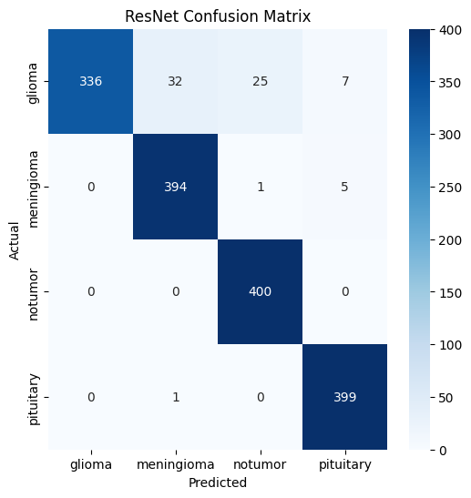
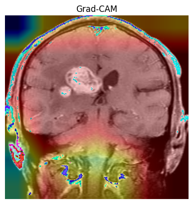
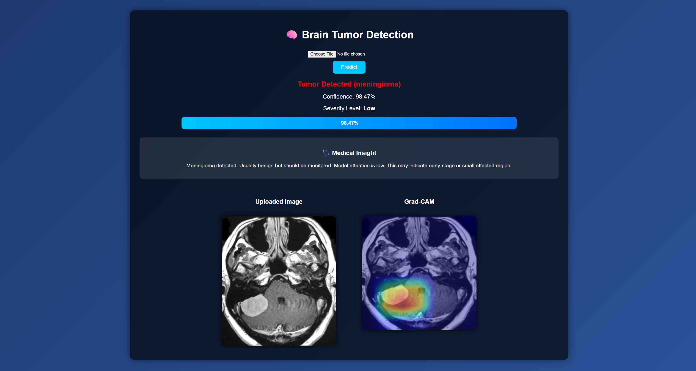
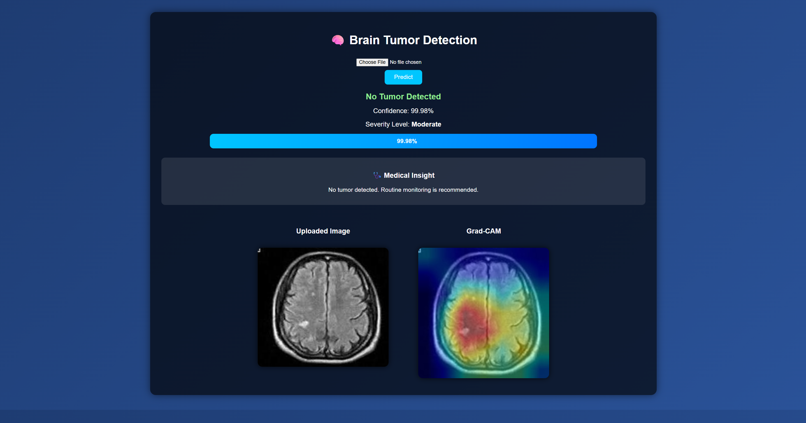

# 🧠 Brain Tumor Detection using Deep Learning

A deep learning-based web application for detecting brain tumors from MRI images using Convolutional Neural Networks and Transfer Learning. The system also provides visual explanations using Grad-CAM to highlight regions influencing the model’s prediction.

---

##  Overview

This project aims to assist in early detection of brain tumors using MRI scans. It leverages deep learning models such as CNN and ResNet to classify images into multiple categories and provides interpretability using Grad-CAM.

The application is deployed as a web interface where users can upload MRI images and receive predictions along with visual explanations.

---

##  Features

* Multi-class tumor classification:

  * Glioma
  * Meningioma
  * Pituitary Tumor
  * No Tumor

* Deep learning models:

  * Custom CNN
  * ResNet (Transfer Learning)

* Grad-CAM visualization for model interpretability

* Confidence score display

* Severity estimation based on activation maps

* Doctor-style AI-generated insights

* Interactive web interface using Flask

---

##  Model Performance

| Model        | Accuracy                  |
| ------------ | ------------------------- |
| CNN          | ~84%                      |
| ResNet       | ~95%                      |
| EfficientNet | (optional / experimental) |

> Note: ResNet provided the best performance after fine-tuning.

---

##  Evaluation Metrics

* Accuracy
* Precision
* Recall
* F1-score
* Confusion Matrix

### 🔹 Confusion Matrix



---

## 🔍 Grad-CAM Visualization

Grad-CAM helps in understanding **where the model is focusing** in the MRI image.



---

## 🖥️ Web Application

The Flask-based web app allows users to:

* Upload MRI image
* Get prediction result
* View confidence score
* Visualize Grad-CAM heatmap
* Read AI-generated medical insight

### 🔹 UI Preview




---

## 🗂️ Project Structure

```
Project_Exhibition_2/
│
├── brain_tumor_dataset/
│   ├── Training/
│   └── Testing/
│
├── model/
│   ├── final_model.h5
│   └── class_labels.json
│
├── static/
│   ├── uploads/
│   └── heatmaps/
│
├── templates/
│   └── index.html
│
├── app.py
├── requirements.txt
└── README.md
```

---

##  Installation

### 1. Clone the repository

```bash
git clone https://github.com/your-username/Brain-Tumor-Detection.git
cd Brain-Tumor-Detection
```

### 2. Create virtual environment

```bash
python -m venv tumor_env
source tumor_env/bin/activate  # Linux/Mac
tumor_env\Scripts\activate     # Windows
```

### 3. Install dependencies

```bash
pip install -r requirements.txt
```

---

##  Run the Application

```bash
python app.py
```

Then open:

```
http://127.0.0.1:5000
```

---

##  How It Works

1. User uploads MRI image
2. Image is preprocessed (resize + normalization)
3. Model predicts tumor class
4. Confidence score is calculated
5. Grad-CAM generates heatmap
6. Severity level is estimated
7. AI generates medical-style insight

---

##  Medical Insight Logic

* **No Tumor** → Safe condition
* **Tumor detected + low activation** → Early stage / small region
* **Tumor detected + high activation** → Larger affected region

> Note: This is an assistive tool, not a medical diagnosis system.

---

##  Disclaimer

This project is intended for educational and research purposes only.
It should not be used as a substitute for professional medical diagnosis.

---

##  Future Improvements

* Use larger medical datasets
* Improve severity estimation with segmentation
* Deploy on cloud (Render / AWS)
* Add user authentication
* Store prediction history
* Integrate with hospital systems

---
